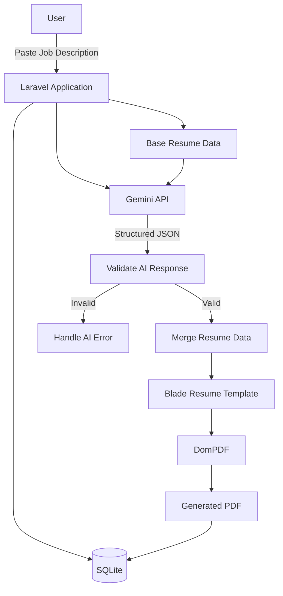
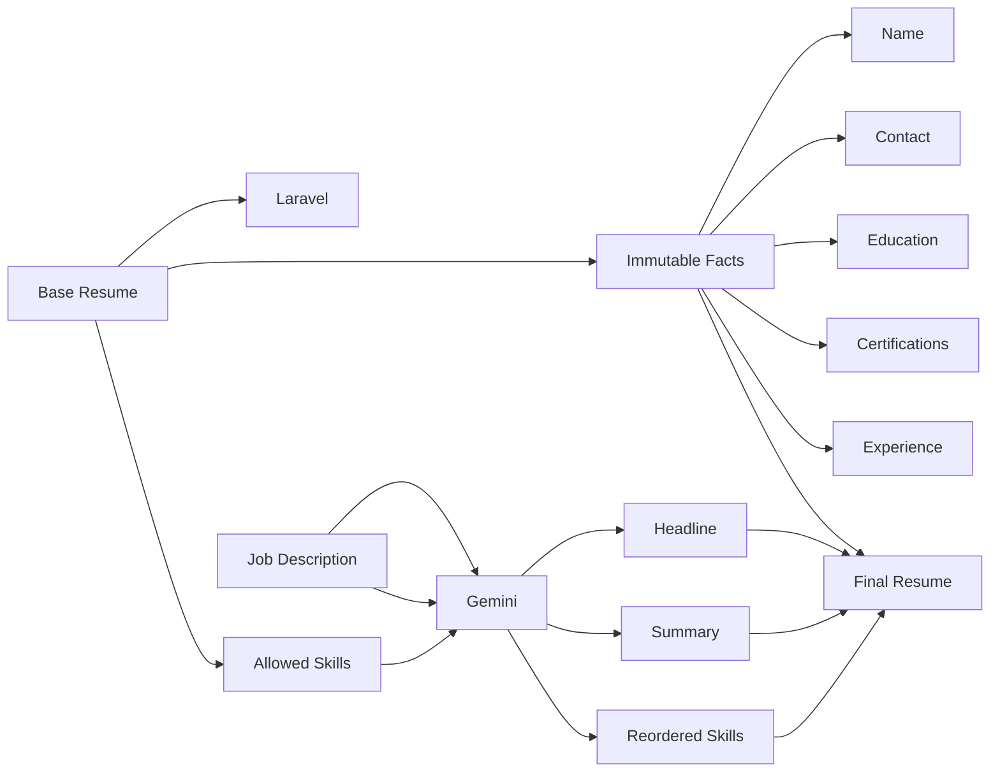
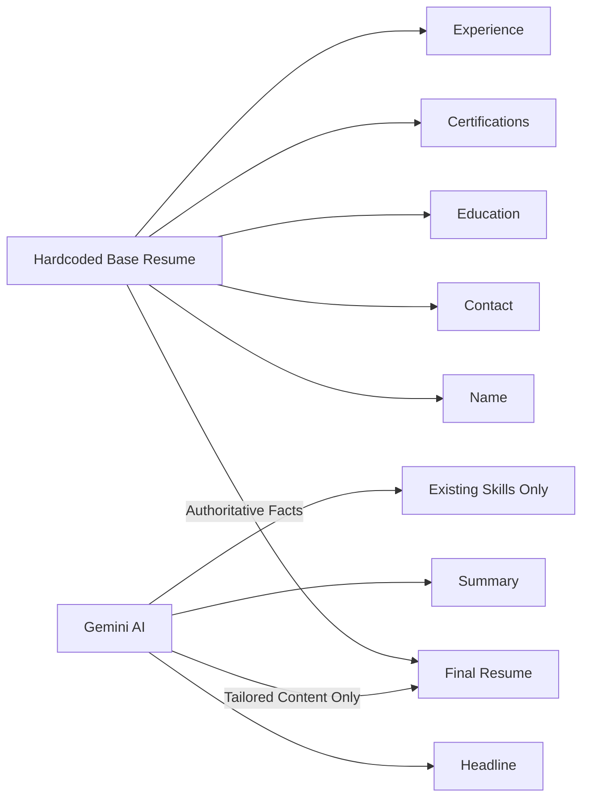

# Resume Tailor

> An AI-powered local resume tailoring tool built with Laravel. Paste a job description, let Gemini tailor the relevant parts of the resume, and generate a polished PDF ready for submission.

## Overview

Resume Tailor is a **local-only Laravel prototype** designed to quickly adapt a base resume to different job descriptions.

The user provides a job description manually. The application sends the job description and the user's predefined resume data to Gemini, which generates a tailored **headline, professional summary, and skills list**. The application then combines those AI-generated sections with the user's fixed resume information and renders the final resume as a PDF.

The system is intentionally minimal and focused on the core workflow.

## Architecture



## Resume Data Flow



## Core Workflow

```text
                    RESUME TAILOR
                         │
                         ▼
              ┌─────────────────────┐
              │ Paste Job Description│
              └──────────┬──────────┘
                         │
                         ▼
              ┌─────────────────────┐
              │   Laravel Backend   │
              └──────────┬──────────┘
                         │
              ┌──────────┴──────────┐
              ▼                     ▼
       Base Resume Data        Gemini API
              │                     │
              │              ┌──────▼──────┐
              │              │ Tailor Only │
              │              │ 3 Sections  │
              │              └──────┬──────┘
              │                     │
              └──────────┬──────────┘
                         ▼
              ┌─────────────────────┐
              │ Validate AI Output  │
              └──────────┬──────────┘
                         │
                         ▼
              ┌─────────────────────┐
              │ Merge Resume Data   │
              └──────────┬──────────┘
                         │
                         ▼
              ┌─────────────────────┐
              │   Blade Template    │
              └──────────┬──────────┘
                         │
                         ▼
              ┌─────────────────────┐
              │       DomPDF        │
              └──────────┬──────────┘
                         │
                         ▼
                  ┌─────────────┐
                  │ Download PDF│
                  └─────────────┘
```

## AI Responsibility

Gemini is deliberately restricted to tailoring only three parts of the resume:

| Section              | AI Can Modify                   |
| -------------------- | ------------------------------- |
| Headline             | Yes                             |
| Professional Summary | Yes                             |
| Skills               | Yes, using existing skills only |
| Full Name            | No                              |
| Contact Information  | No                              |
| Education            | No                              |
| Certifications       | No                              |
| Job Titles           | No                              |
| Companies            | No                              |
| Employment Dates     | No                              |
| Experience Bullets   | No                              |

The AI **does not own the resume**. It only produces tailored content that is merged with the authoritative base resume.

### No Fabrication

Gemini must not invent:

* Skills
* Technologies
* Work experience
* Job titles
* Companies
* Dates
* Certifications
* Education
* Achievements

The skills returned by Gemini must come from the predefined base skill list.

## Expected AI Response

The application expects Gemini to return strict structured data containing only:

```text
headline
summary
skills[]
```

The Laravel application validates the response before using it.

It must also safely handle cases where Gemini:

* Wraps JSON in Markdown fences
* Returns malformed JSON
* Omits required fields
* Returns incorrect data types
* Returns skills that are not part of the approved skill list
* Fails to respond successfully

Invalid AI output must never be treated as valid resume data.

## Technology Stack

| Technology          | Purpose                  |
| ------------------- | ------------------------ |
| Laravel 11          | Application backend      |
| PHP 8.2+            | Backend language         |
| Blade               | Resume template and UI   |
| Gemini 2.0 Flash    | AI tailoring             |
| Laravel HTTP Client | Gemini API communication |
| DomPDF              | PDF generation           |
| SQLite              | Local persistence        |
| `.env`              | API key configuration    |

## Project Scope

This is intentionally a small prototype.

### Included

* Manual job description input
* AI-assisted resume tailoring
* Structured AI response validation
* Blade-based resume rendering
* PDF generation
* Local tailoring history
* Optional history interface

### Not Included

* Authentication
* Multi-user support
* Multi-tenancy
* Job scraping
* Job board integrations
* Automated job searching
* Automatic applications
* Application submission
* Email automation
* Cloud deployment
* Production infrastructure

## Data Ownership

The application follows a simple separation of responsibility:



**Base resume data is the source of truth.**

Gemini is a transformation layer, not a source of factual information.

## Local Development

The application is intended to run locally only using Laravel's development server.

```text
Browser
   │
   ▼
localhost
   │
   ▼
Laravel
   │
   ├── Gemini API
   ├── SQLite
   └── DomPDF
```

The Gemini API key is stored in `.env` and must never be hardcoded or committed to the repository.

## Design Goal

The prototype prioritizes:

* Clear separation between factual and AI-generated data
* Predictable AI output
* Validation before rendering
* Simple Laravel architecture
* Maintainable Blade templates
* Minimal dependencies
* Local-first development
* No unnecessary production infrastructure

The main objective is not to build a full resume platform, but to create a **small, reliable pipeline for turning a job description into a tailored resume PDF while keeping factual resume information under strict application control.**
